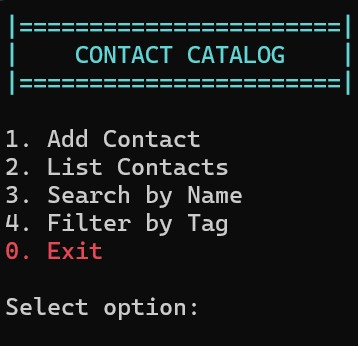

|    CONTACT CATALOG    |

#Beskrivning: 
- Detta är ett enkelt program som körs i konsolen. 
- När programmet körs är det enkelt att använda. 
Man kan lägga till kontakter, visa alla kontakter, söka efter namn, filtrera efter tagg och avsluta.

#Designval:
- Jag delade upp programmet i flera delar för att hålla det tydligt och lätt att arbeta med.
Contact beskriver datan, Repository hanterar lagringen, Service innehåller logiken och Validator ser till att e-post och dubbletter hanteras rätt.
Det gör koden mer strukturerad, lättare att testa och enklare att bygga vidare på i framtiden.

#Bruksanvisning:
- Starta programmet i Visual Studio och tryck på "Start" eller tryck på Ctrl + F5.

#Skapare: Joco Borghol

